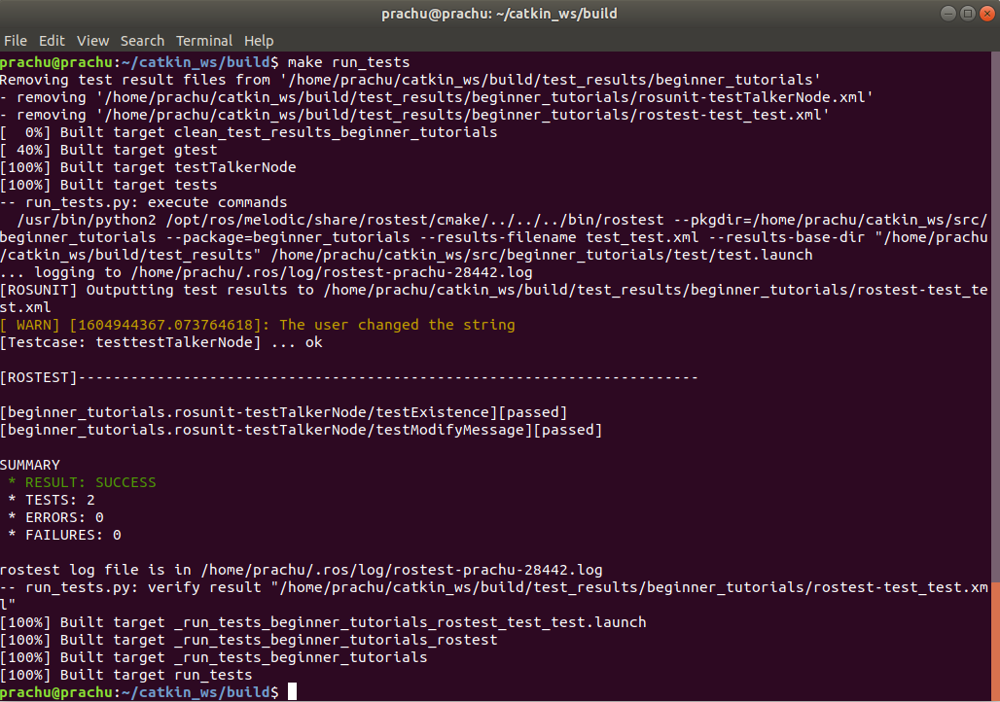
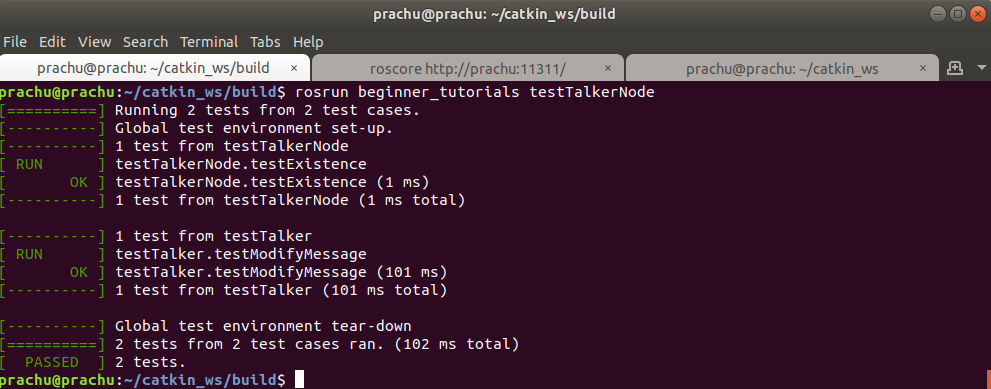

# beginner_tutorials
[](https://github.com/Pradeep-Gopal/beginner_tutorials/blob/master/LICENSE)

## Author

Pradeep Gopal

## Overview

This short tutorial on implementation of basic ROS C++ Publisher and Subscriber.
ROS publisher sends the messages and ROS subscriber subscribes and receives the messages.

Talker (src/talker.cpp): Publisher
Listener (src/listener.cpp): Subscriber

all_nodes.launch is the launch file which can be used to launch both talker and listener nodes.

changeBaseString.srv is a service used to change the output string upon request by the user.

## Dependencies

ROS Melodic should be installed on your computer (preferably Ubuntu 18.04).
Catkin workspace must be set up.

## Set up and build

- Suppose your catkin workspace is 'catkin_ws' which has build, src and devel folders.
- Open new terminal and run the command 
```
git clone --recursive https://github.com/Pradeep-Gopal/beginner_tutorials

```
- Move the cloned folder to catkin_ws/src.
- Open terminal and run the following commands:
```
  cd ~/catkin_ws
  source ./devel/setup.bash
  catkin_make

```
## Steps to run the publisher and subscriber using rosrun

- Open catkin_ws in a terminal and source your workspace's setup.sh file by running the following commands:
```
  cd ~/catkin_ws
  source ./devel/setup.bash
  
```
- Run the following command to start the master
```
  roscore
  
```
- Open new terminal and run the following commands to run the publisher:
```
  cd ~/catkin_ws
  source ./devel/setup.bash
  rosrun beginner_tutorials talker

```
- Open new terminal and run the following commands to run the subscriber:
```
  cd ~/catkin_ws
  source ./devel/setup.bash
  rosrun beginner_tutorials listener

```

## Steps to run the publisher and subscriber at once using launch file

Make sure thte master is running and type the following command in a new terminal:
```
roslaunch beginner_tutorials all_nodes.launch

```
User can change the frequency at which the loop operates by the following command:
```
roslaunch beginner_tutorials nodes.launch my_rate:=<desired_frequency>

Example: roslaunch beginner_tutorials nodes.launch my_rate:=4

```
Replace <desired_frequency> with the required number 

## Service to change the output string

User can change the output string message by running the following command in a new terminal:
```
rosservice call /changeBaseString "text"

Example: rosservice call /changeBaseString "Hey There!"

```

## To Run ROSTEST

### Method 1 using catkin
The level 2 Integration tests can be run using the following commands-

Open a terminal to run the test using catkin: 
```
cd ~/catkin_ws
source ./devel/setup.bash
catkin_make run_tests_beginner_tutorials

```

<p>Following image shows a demo of ROSTEST in action using catkin</p>
<p align="center">

</p>


### Method 2 using testTalkerNode node

In first Terminal, 
```
roscore
```

In second terminal,
```
cd ~/catkin_ws
source ./devel/setup.bash
rosrun beginner_tutorials talker

```

In third terminal,
```
cd ~/catkin_ws
source ./devel/setup.bash
rosrun beginner_tutorials testTalkerNode

```

<p>Following image shows a demo of ROSTEST in action using testTalkerNode node</p>
<p align="center">

</p>

## Steps to record and play a Rosbag file
ROSBag recording can be done using the following command-
Open a terminal to run the launch file: 
```
cd ~/catkin_ws
source ./devel/setup.bash
roslaunch beginner_tutorials all_nodes.launch rosBagEnable:=true
```
When the flag(default = false) is true, it will record until SIGINT(ctrl+c) is pressed.

Following are the steps to examine the recorded bag file
1. Open a terminal to run roscore: 
```
cd ~/catkin_ws
source ./devel/setup.bash
roscore
```
Ensure if roscore is running in the terminal. For any issues check [ROS Troubleshoot](http://wiki.ros.org/ROS/Troubleshooting)

2. Open a new terminal to setup the Listener Node: 
```
cd ~/catkin_ws
source ./devel/setup.bash
rosrun beginner_tutorials listener
```
No output will be displayed, until the rosbag is played.

3. Open a new terminal to play the bag file:
```
cd ~/catkin_ws
source ./devel/setup.bash
cd src/beginner_tutorials/results
rosbag play rostopics_bag.bag
```
The info on rosbag file can be seen using the following command
```
cd ~/catkin_ws/src/beginner_tutorials/results
rosbag info rostopics_bag.bag
```

## Logging

To see the message log in real time, we use rqt_console GUI.
Type the following command in a new terminal:
```
rqt_console
```

## To terminate

press Ctrl-C to terminate both the listener and the talker

## Running cpp-check

```
cppcheck --enable=all --std=c++11 -I include/ --suppress=missingIncludeSystem $( find . -name *.cpp | grep -vE -e "^./build/" -e "^./vendor/" -e "^./src/")

```

## Running cpp-lint

```
cpplint $( find . -name \*.hpp -or -name \*.cpp | grep -vE -e "^./build/" -e "^./vendor/" -e "^./docs/" -e "^./results" )

```


